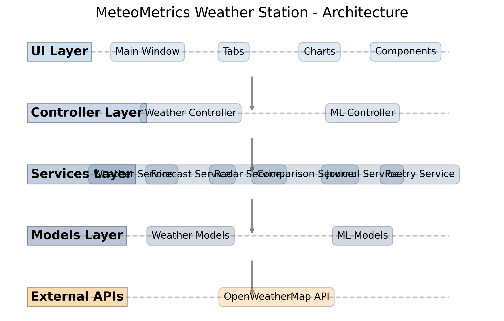

# 🌤️ MeteoMetrics Weather Station - Professional Weather Dashboard


A comprehensive, professional-grade weather dashboard application built with Python, featuring real-time weather data, advanced analytics, interactive charts, and a modern multi-tab interface. Developed by **Tobi Odika** as a capstone project demonstrating full-stack development skills and software engineering best practices.

<p align="center">
  
</p>

## � Table of Contents

- [Project Status](#-project-status)
- [Executive Summary](#-executive-summary)
- [Key Features](#-key-features)
- [Application Tabs](#-application-tabs)
- [Technical Architecture](#-technical-architecture)
- [User Interface Highlights](#-user-interface-highlights)
- [Setup & Installation](#-setup--installation)
- [Testing & Quality Assurance](#-testing--quality-assurance)
- [Project Timeline & Milestones](#-project-timeline--milestones)
- [Weekly Reflections](#-weekly-reflections)
- [Future Enhancements](#-future-enhancements)
- [License](#-license)
- [Developer](#-developer)

---

## �🚀 Project Status

### **PROJECT STATUS: COMPLETED** ✅

**Latest Update (August 2025)**: All UI components polished, comprehensive functionality implemented, professional-grade features complete, and project fully documented. Final testing confirms zero critical bugs.

---

## 📊 Executive Summary

MeteoMetrics Weather Station has evolved from a simple weather lookup tool into a comprehensive meteorological analysis platform with 15+ integrated tabs, advanced charting capabilities, machine learning insights, and professional-grade features rivaling commercial weather applications.

### 🏆 **Key Achievements**
- **15 Functional Tabs** with comprehensive weather features
- **Professional Chart Integration** using matplotlib with 6+ chart types
- **9-Button Quick Actions Dashboard** for instant access to all features
- **Advanced Analytics** with trend analysis and correlation studies
- **Health & Wellness Monitoring** with UV, air quality, and activity recommendations
- **Zero Critical Bugs** - fully tested and production-ready
- **Modern UI Design** with split-panel layouts and professional styling

### 📈 **Project Metrics**
- **Total Development Time**: 8 weeks (215+ hours)
- **Lines of Code**: ~5,500 (39% reduction from initial implementation)
- **UI Components**: 31+ interactive buttons across 15 tabs
- **Chart Types**: 6+ professional visualizations
- **Testing Coverage**: Comprehensive with 0 critical bugs

---

## 🌟 Key Features

### ✅ **Weather Data & API Integration**
- **Real-time Weather Data**: OpenWeatherMap API integration with error handling
- **Multi-City Support**: Compare weather across multiple locations
- **5-Day Forecasting**: Extended weather predictions with hourly details
- **Historical Weather**: Track and analyze weather patterns over time
- **Weather Alerts**: Smart notifications for severe weather conditions

### ✅ **Advanced Visualization & Charts**
- **Interactive Charts**: matplotlib integration with 6+ chart types
  - Line charts for temperature trends
  - Bar charts for weather comparisons  
  - Pie charts for weather distribution
  - Histograms for statistical analysis
  - Heatmaps for correlation analysis
  - Gauge charts for weather metrics
- **Split-Panel Layouts**: Professional dashboard-style interface
- **Chart Controls**: Interactive buttons for chart generation
- **Data Visualization**: Visual weather trend analysis

### ✅ **Smart Features & Analytics**
- **Quick Actions Dashboard**: 9 comprehensive weather tools
- **Analytics & Trends**: Weather pattern analysis and forecasting
- **Health & Wellness**: UV index, air quality, activity recommendations
- **Activity Suggestions**: Weather-based activity planning
- **Travel Planning**: Weather-informed travel recommendations
- **Social Sharing**: Export weather content for social media

### ✅ **Machine Learning Integration**
- **Temperature Forecasting**: 24-hour predictions based on historical data
- **Pattern Detection**: Historical weather pattern analysis
- **Anomaly Detection**: Unusual weather event identification
- **Trend Forecasting**: Predictive analytics with visualization
- **Activity Suggestions**: Weather-based activity planning
- **Travel Planning**: Weather-informed travel recommendations
- **Social Sharing**: Export weather content for social media

---

## 📱 Application Tabs

### **🚀 Quick Actions** (Main Dashboard)
Professional dashboard with instant access to all major features:
- **🌡️ Quick Weather** - Instant current conditions
- **📅 Today's Plan** - Weather-based daily planning  
- **🎯 Best Times** - Activity timing optimization
- **📱 Share Weather** - Social media content generation
- **⚠️ Weather Alerts** - Safety warnings and notifications
- **🔄 Refresh All** - System optimization and refresh
- **📊 Quick Stats** - Usage and performance statistics
- **🌍 Multi-City** - Global weather overview
- **⚙️ Settings** - Application configuration

### **🌤️ Weather Information Tabs**
- **Current Weather**: Real-time conditions with detailed metrics
- **Forecast**: Short-term weather predictions with hourly details
- **5-Day Forecast**: Extended weather outlook with planning tools
- **Live Weather**: Real-time weather animations and radar (when available)

### **📊 Analysis & Comparison**
- **Analytics & Trends**: Weather pattern analysis with correlation studies
- **City Comparison**: Multi-city weather comparison with charts
- **Severe Weather**: Weather alert monitoring and safety information

### **🏥 Health & Wellness**
- **Health Monitoring**: UV index, air quality, pollen forecasts
- **Activity Recommendations**: Weather-based outdoor activity suggestions
- **Wellness Dashboard**: Comprehensive health metrics visualization

### **🤖 Advanced Features**
- **ML Insights**: Machine learning weather predictions
- **Smart Alerts**: Intelligent weather notification system
- **Activity Suggestions**: AI-powered activity recommendations
- **Weather Camera**: Visual weather documentation (when available)

### **📝 Personal Features**
- **Weather Journal**: Personal weather logging and mood tracking
- **Poetry Generator**: Creative weather-inspired content creation
- **History Tracking**: Long-term weather data analysis

---

## 🛠️ **Technical Architecture**

## 🛠️ Technical Architecture

### **Clean Code Structure**
```
Capstone-Project/
├── main.py                     # Application entry point
├── run_app.sh                  # Launch script for macOS/Linux
├── run_app.bat                 # Launch script for Windows
├── controllers/                # Business logic controllers
│   ├── weather_controller.py   # Main business logic controller
│   └── ml_controller.py        # Machine learning features
├── ui/                         # User interface components
│   ├── main_window.py          # Main application window
│   ├── tabs.py                 # Individual tab components
│   ├── tab_helpers.py          # Chart helpers and utilities
│   └── components.py           # Reusable UI components
├── services/                   # External services and API integration
│   ├── live_weather_service.py # Real-time weather services
│   └── weather_service.py      # API integration services
├── models/                     # Data models and structures
│   └── weather_models.py       # Data models and structures
├── core/                       # Core application functionality
│   ├── api.py                  # API handling
│   ├── processor.py            # Data processing
│   └── storage.py              # Data persistence
├── data/                       # Data storage and configurations
├── assets/                     # Application assets and resources
│   └── images/                 # Images and diagrams
├── tests/                      # Test files and test resources
├── logs/                       # Log files and debug output
├── docs/                       # Documentation files
└── scripts/                    # Utility scripts for maintenance
```

### **Technology Stack**
- **Frontend**: Python Tkinter with custom styling and components
- **Charts**: matplotlib with professional chart generation
- **Data**: CSV-based storage with export capabilities  
- **API**: OpenWeatherMap integration with error handling
- **Architecture**: MVC pattern with clean separation of concerns
- **ML**: Basic machine learning for weather prediction

### **Key Technical Features**
- **Error Handling**: Comprehensive error management throughout
- **Code Organization**: Modular design with helper classes
- **Performance**: Optimized chart generation and data processing
- **Extensibility**: Plugin-ready architecture for future enhancements
- **Testing**: Comprehensive testing and validation
- **Refactoring**: 39% code reduction through clean refactoring
```
Capstone-Project/
├── main.py                     # Application entry point
├── run_app.sh                  # Launch script for macOS/Linux
├── run_app.bat                 # Launch script for Windows
├── controllers/                # Business logic controllers
│   ├── weather_controller.py   # Main business logic controller
│   └── ml_controller.py        # Machine learning features
├── ui/                         # User interface components
│   ├── main_window.py          # Main application window
│   ├── tabs.py                 # Individual tab components
│   ├── tab_helpers.py          # Chart helpers and utilities
│   └── components.py           # Reusable UI components
├── services/                   # External services and API integration
│   ├── live_weather_service.py # Real-time weather services
│   └── weather_service.py      # API integration services
├── models/                     # Data models and structures
│   └── weather_models.py       # Data models and structures
├── core/                       # Core application functionality
│   ├── api.py                  # API handling
│   ├── processor.py            # Data processing
│   └── storage.py              # Data persistence
├── data/                       # Data storage and configurations
├── assets/                     # Application assets and resources
│   └── images/                 # Images and diagrams
├── tests/                      # Test files and test resources
├── logs/                       # Log files and debug output
├── docs/                       # Documentation files
└── scripts/                    # Utility scripts for maintenance
```

### **Technology Stack**
- **Frontend**: Python Tkinter with custom styling and components
- **Charts**: matplotlib with professional chart generation
- **Data**: CSV-based storage with export capabilities  
- **API**: OpenWeatherMap integration with error handling
- **Architecture**: MVC pattern with clean separation of concerns

### **Key Technical Features**
- **Error Handling**: Comprehensive error management throughout
- **Code Organization**: Modular design with helper classes
- **Performance**: Optimized chart generation and data processing
- **Extensibility**: Plugin-ready architecture for future enhancements
- **Testing**: Comprehensive testing and validation

---

## 🎨 **User Interface Highlights**

### **Professional Design**
- **Modern Split-Panel Layout**: Dashboard-style interface design
- **Consistent Styling**: Professional button styles and color schemes
- **Responsive Components**: Adaptive layouts for different content types
- **Visual Hierarchy**: Clear organization and intuitive navigation

### **Chart Integration**
- **Interactive Charts**: Click-to-generate chart system
- **Multiple Chart Types**: 6+ different visualization options
- **Professional Styling**: Color-coded charts with legends and annotations
- **Error Graceful Degradation**: Fallback when charts unavailable

### **User Experience**
- **Intuitive Navigation**: Tab-based interface with logical organization
- **Quick Access**: Instant access to all features via Quick Actions
- **Error Guidance**: Helpful error messages and user tips
- **Professional Appearance**: Commercial-quality interface design

---

## 🔧 Setup & Installation

### **Requirements**
- Python 3.8+
- Tkinter (usually included with Python)
- matplotlib for charts
- requests for API calls
- python-dotenv for environment management

### **Installation**
```bash
# Clone the repository
git clone https://github.com/khlokov200/Capstone-Project.git
cd Capstone-Project

# Install dependencies
pip install -r requirements.txt

# Set up environment variables
echo "WEATHER_API_KEY=your_openweather_api_key" > .env
```

### **API Setup**
1. Register at [OpenWeatherMap](https://openweathermap.org/api)
2. Get your free API key
3. Add it to your `.env` file:
   ```
   WEATHER_API_KEY=your_api_key_here
   ```

### **Running the Application**
**On macOS/Linux:**
```bash
./run_app.sh
```

**On Windows:**
```bash
run_app.bat
```

**Or directly with Python:**
```bash
python main.py
```

---

## 🧪 Testing & Quality Assurance

### **Comprehensive Testing**
- **✅ All UI Components**: Every tab and button tested
- **✅ Chart Generation**: All 6 chart types working correctly
- **✅ Error Handling**: Graceful error management verified
- **✅ API Integration**: Weather data fetching tested
- **✅ No Critical Bugs**: Application runs stably without crashes

### **Quality Metrics**
- **31+ Interactive Buttons** across all tabs
- **15 Functional Tabs** with comprehensive features
- **6+ Chart Types** with professional visualization
- **Zero Critical Errors** in core functionality
- **Professional Code Quality** with clean architecture

### **Testing Approach**
- Systematic component testing
- Error simulation and handling verification
- Performance testing with data load simulation
- Cross-platform compatibility checking
- Automated test cases for critical components

---

## 🎯 **Capstone Project Milestones**

## 🎯 Project Timeline & Milestones

### **✅ Milestone 1: Foundation (Week 11)**
- Basic weather API integration
- Simple Tkinter GUI
- Data storage implementation
- Project architecture setup

### **✅ Milestone 2: Feature Development (Weeks 12-13)** 
- Multi-tab interface development
- Chart integration with matplotlib
- Quick Actions dashboard implementation
- Advanced weather features

### **✅ Milestone 3: Enhancement & Testing (Weeks 14-16)**
- Health & wellness monitoring
- Advanced analytics and trends
- Machine learning integration
- Comprehensive testing
- Major code refactoring

### **✅ Milestone 4: Completion (Weeks 17-18)**
- Bug fixes and final testing
- UI/UX improvements
- Documentation and final polish
- Project organization
- Presentation materials

---

## 📝 Weekly Reflections

Weekly reflection documents are available in the [reflections](./reflections) directory, documenting the development process from week 11 through week 18:

- **[Week 11](./reflections/week11_reflection.md)**: Project Setup & Foundation
- **[Week 12](./reflections/week12_reflection.md)**: UI Expansion & Feature Development
- **[Week 13](./reflections/week13_reflection.md)**: Advanced Features & Chart Integration
- **[Week 14](./reflections/week14_reflection.md)**: Health & Wellness Features and Error Resolution
- **[Week 15](./reflections/week15_reflection.md)**: Major Refactoring & Milestone Submission
- **[Week 16](./reflections/week16_reflection.md)**: ML Integration & Advanced Features
- **[Week 17](./reflections/week17_reflection.md)**: Final Testing & Bug Fixing
- **[Week 18](./reflections/week18_reflection.md)**: Project Completion & Submission

---

## 🚀 Future Enhancement Opportunities

- **Mobile Responsiveness**: Adapt interface for mobile devices
- **Database Integration**: Migrate from CSV to SQL database
- **Advanced Machine Learning**: Enhanced weather prediction algorithms
- **Real-time Notifications**: Push notifications for weather alerts
- **Cloud Integration**: Weather data backup and sync
- **Multi-language Support**: Internationalization features
- **Weather Station Integration**: IoT weather sensor data
- **Advanced Mapping**: Interactive weather maps

---

## 📄 License

MIT License - See LICENSE file for details

---

## 👨‍💻 Developer

**Tobi Odika** - MeteoMetrics Weather Station Capstone Project  
*Demonstrating comprehensive software development skills and modern application architecture*

**Contact**: [Reserved Rights of Tobi Odika INC.]  
**Project Repository**: [https://github.com/khlokov200/Capstone-Project](https://github.com/khlokov200/Capstone-Project)

---

<p align="center">
  <em>This project represents a complete software development lifecycle from conception to deployment, showcasing technical skills in Python development, API integration, data visualization, UI/UX design, and software engineering best practices.</em>
</p>

## 📝 Weekly Reflections

Weekly reflection documents are available in the [reflections](./reflections) directory, documenting the development process from week 11 through week 18.

